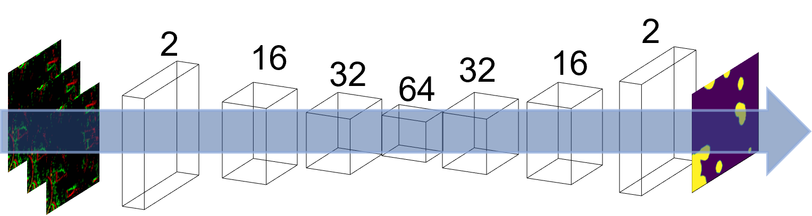

# イベントカメラとスパイキングニューラルネットワークによる月面の障害物検出

宇宙機が月面に安全に着陸するため、クレータを含む障害物を避けるために検知する必要がある。 
そしてよりロバストな推定のために機械学習による推定が求められている。
一方で、宇宙機は消費電力の制約があるため、機械学習による推定は低消費電力で動作する必要がある。また宇宙機着陸時は時間制約が非常に限られており、低レーテンシで推定する必要がある。  
そこでイベントカメラとスパイキングニューラルネットワークにより低消費電力かつ低レーテンシで動作するイベントカメラとスパイキングニュラールネットワークを活用して、安全領域の推定を行う。

# DEMO

ネットワーク概要はこんな感じです。層数やチャネル数は多少異なる可能性あり。


# Features

- 低消費電力で動作する
- 低レーテンシで動作する 
- 月面の障害物を検出する
- ニューロモフィックチップに実装も行っている

# 必要ライブラリ
anacondaで環境作るのおすすめです。  
ライブラリはおおきくGPU関連(pytorchなど)とそれ以外のライブラリに分かれます。  
*  **GPU関連のライブラリ**：gpuを使用したい場合(機械学習はGPU無いとかなりきついです。ほぼ必須です)は、pytorchのライブラリを使用します。ただ自分が使用しているGPUの種類(RTX30~~など)によってCUDAやpytorchのライブラリのバージョンを指定する必要があります。ですので[金子研究室のサイト](https://www.kkaneko.jp/tools/wsl/wsl_tensorflow2.html)を見て環境構築することを強くお勧めします。
* **GPU 関連以外のライブラリ**：GPU関連以外のライブラリに関してはは`conda_emv.yml`に記載してあります。次のコマンドで環境を作ってください。
```bash
conda create -n 環境名 -f conda_env.yml
```


# フォルダ説明  
-  `easy_task`：簡単なタスク。イベントデータ疑似生成させ、安全かどうかの分類やセマセグなどのタスクができるかをチェックするためのコード。
- `dem`：よりリアルなタスクを行う。シミュレーションで作成したDEMを用いて学習を行う。

-  `v2e-master`：動画からイベントデータをシミュレーション上で生成するためのコード。[こちら](https://github.com/SensorsINI/v2e)のコードを使用しています。このフォルダーはそのまま使用してください。

