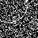

# 疑似イベントデータとスパイキングニューラルネットワークによるクレーター検知のeasy task

まずは実験として、イベントを疑似生成させ検知できるのかを確かめる。
疑似イベントはある確率に基づいてシミュレーション上でランダムで生成。

# DEMO
## classification
次の二枚のような疑似イベントデータをＳＮＮに与え、クレータ(実際は円)があるか無いかの分類を行う。  

## classification
次のようなイベントデータをＳＮＮに与え、クレータ(円)内部を塗りつぶすセマセグを行う。  

# Features

- イベント発生確率を調整できる

# フォルダ説明  
-  `classification`：クレータがあるかないかの分類を行う。
- `segmentation`：円の内部を塗りつぶすセマセグを行う。

