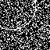

# イベント駆動コンピューティングによる月面の障害物検知（簡単なセマセグ）

月面クレータをイベントカメラ使って検知したい。まずはイベントデータを疑似生成し、フレーム内にクレーター(円)を用意し、クレータ内部を塗りつぶすセマセグを行う。

# DEMO
次のようなイベントデータをＳＮＮに与え、クレータ(円)内部を塗りつぶすセマセグを行う。  
もっと詳しく見たかったラ`youtube`フォルダ内を見て  

# ファイル説明
1. データ生成  
    - `make_data.py`：イベントデータを疑似生成。月面に近づき、クレータがおおきくなっていくイベントデータを再現。  
2. 学習
    - `train.py`：イベント疑似データを使って学習させる。
3. 解析
    - `analysis.ipynb`：学習結果を解析
4. その他ファイル説明
    - `model.py`：モデル定義
    ‐ `data.py`: データローダー定義
    - `openh5.py`: h5ファイルの中身を確認＆`youtube`フォルダ内に動画を保存する

    
